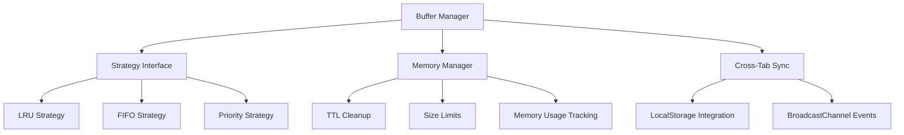

# Buffer System Architecture
## Intelligent Event Buffering with Multiple Strategies

---

## 🎯 **Overview**

The Buffer System provides **intelligent event management** with configurable strategies, TTL-based cleanup, and cross-environment synchronization. It prevents lost events through replay functionality while maintaining memory safety.

---

## 🏗️ **System Architecture**



---

## 🔧 **Core Components**

### **BufferManager Interface** (`src/core/buffer/index.ts`)

```typescript
interface BufferManager {
  // Core operations
  add<T>(event: BaseEvent<T>): void;
  get(channel: string): BufferedEvent<unknown>[];
  has(channel: string): boolean;
  clear(channel?: string): void;
  size: number;
  
  // Configuration
  configure(config: Partial<BufferConfig>): void;
  
  // Monitoring
  getMetrics(): BufferMetrics;
  
  // Management
  evictExpired(): number;
}
```

### **Strategy Pattern**

```typescript
interface BufferStrategy {
  add<T>(buffer: Map<string, BufferedEvent<unknown>[]>, event: BufferedEvent<T>): void;
  shouldEvict<T>(buffer: Map<string, BufferedEvent<unknown>[]>, channel: string): boolean;
  evictOldest<T>(buffer: Map<string, BufferedEvent<unknown>[]>, channel: string): BufferedEvent<unknown> | null;
}
```

---

## 🎨 **Strategy Implementations**

### **LRU (Least Recently Used) Strategy** (`strategies/lru.ts`)

#### **Algorithm**
```typescript
class LRUStrategy implements BufferStrategy {
  private accessOrder = new Map<string, number>();
  private accessCounter = 0;

  add<T>(buffer: Map<string, BufferedEvent<unknown>[]>, event: BufferedEvent<T>): void {
    const channel = event.channel;
    let events = buffer.get(channel) || [];
    
    // Add new event to end
    events.push(event);
    
    // Update access time for LRU tracking
    this.accessOrder.set(channel, ++this.accessCounter);
    
    // Evict oldest if over capacity
    if (events.length > this.config.maxSize) {
      events.shift(); // Remove oldest (LRU adjustment)
    }
    
    buffer.set(channel, events);
  }

  onAccess<T>(buffer: Map<string, BufferedEvent<unknown>[]>, channel: string): void {
    // Update access time when channel is read
    this.accessOrder.set(channel, ++this.accessCounter);
    
    // Move accessed events to end (LRU behavior)
    const events = buffer.get(channel);
    if (events && events.length > 1) {
      const lastEvent = events.pop();
      if (lastEvent) {
        events.unshift(lastEvent);
      }
      buffer.set(channel, events);
    }
  }
}
```

#### **Characteristics**
- **Time Complexity**: O(1) for add/remove, O(1) for access
- **Space Complexity**: O(n) where n = buffer size
- **Use Case**: Frequently accessed channels benefit significantly
- **Memory Efficiency**: Excellent cache hit ratio for hot channels

### **FIFO (First In, First Out) Strategy** (`strategies/fifo.ts`)

#### **Algorithm**
```typescript
class FIFOStrategy implements BufferStrategy {
  add<T>(buffer: Map<string, BufferedEvent<unknown>[]>, event: BufferedEvent<T>): void {
    const channel = event.channel;
    let events = buffer.get(channel) || [];
    
    // Add new event to end
    events.push(event);
    
    // Evict oldest if over capacity (FIFO behavior)
    if (events.length > this.config.maxSize) {
      events.shift();
    }
    
    buffer.set(channel, events);
  }

  evictOldest<T>(buffer: Map<string, BufferedEvent<unknown>[]>, channel: string): BufferedEvent<unknown> | null {
    const events = buffer.get(channel) || [];
    return events.length > 0 ? events.shift() || null : null;
  }
}
```

#### **Characteristics**
- **Time Complexity**: O(1) for all operations
- **Space Complexity**: O(n)
- **Use Case**: Chronological event ordering required
- **Predictability**: Highly predictable behavior

### **Priority Strategy** (`strategies/priority.ts`)

#### **Algorithm**
```typescript
class PriorityStrategy implements BufferStrategy {
  add<T>(buffer: Map<string, BufferedEvent<unknown>[]>, event: BufferedEvent<T>): void {
    const channel = event.channel;
    let events = buffer.get(channel) || [];
    
    // Add new event with priority preservation
    events.push(event);
    
    // Sort by priority (high first)
    events.sort((a, b) => {
      const priorityA = this.getPriority(a);
      const priorityB = this.getPriority(b);
      return this.comparePriority(priorityA, priorityB);
    });
    
    // Evict lowest priority if over capacity
    if (events.length > this.config.maxSize) {
      events.pop();
    }
    
    buffer.set(channel, events);
  }

  private getPriority<T>(event: BufferedEvent<T>): EventPriority {
    // Extract priority from event type or options
    if (event.type === 'high') return 'high';
    if (event.type === 'medium') return 'medium';
    return 'low';
  }
}
```

#### **Priority Levels**
```typescript
type EventPriority = 'high' | 'medium' | 'low';

const PRIORITY_WEIGHT = {
  high: 3,
  medium: 2,
  low: 1
};
```

#### **Characteristics**
- **Time Complexity**: O(n log n) due to sorting
- **Space Complexity**: O(n)
- **Use Case**: Critical event handling with guaranteed delivery
- **Flexibility**: Configurable priority levels

---

## 🧠 **Memory Management** (`memory/ttl.ts`)

### **TTL-Based Cleanup**
```typescript
export default function createTTLManager(ttl: number, maxSize: number): MemoryManager {
  return {
    cleanup<T>(buffer: Map<string, BufferedEvent<T>[]>): number {
      let cleanedCount = 0;
      const now = Date.now();
      
      for (const [channel, events] of buffer.entries()) {
        const originalLength = events.length;
        
        // Remove expired events
        for (let i = events.length - 1; i >= 0; i--) {
          const event = events[i];
          if (isExpired(event)) {
            events.splice(i, 1);
            cleanedCount++;
          }
        }
        
        // Update buffer if events were removed
        if (events.length < originalLength) {
          buffer.set(channel, events);
        }
      }
      
      return cleanedCount;
    },
    
    isExpired(event: BufferedEvent<unknown>): boolean {
      if (!event.ttl) return false;
      const now = Date.now();
      return now - event.bufferedAt > event.ttl;
    }
  };
}
```

### **Memory Usage Estimation**
```typescript
const calculateMemoryUsage = (buffer: Map<string, BufferedEvent<unknown>[]): number => {
  let totalEvents = 0;
  let memoryUsage = 0;
  
  for (const [channel, events] of buffer.entries()) {
    totalEvents += events.length;
    // Rough estimation: 100 bytes per event
    memoryUsage += events.length * 100;
  }
  
  return memoryUsage;
};
```

---

## 🔄 **Cross-Tab Synchronization** (`synchronization/cross-tab.ts`)

### **BroadcastChannel Communication**
```typescript
export default function createSynchronizationManager(): SynchronizationManager {
  const bc = new BroadcastChannel('the-base-event-sync');
  
  return {
    sync<T>(event: BaseEvent<T>): void {
      // Broadcast event to other tabs
      bc.postMessage({
        type: 'sync-event',
        data: event
      });
    },
    
    onSync<T>(callback: (event: BaseEvent<T>) => void): void {
      bc.addEventListener('message', (event) => {
        if (event.data?.type === 'sync-event') {
          callback(event.data.data);
        }
      });
    }
  };
}
```

### **LocalStorage Integration**
```typescript
const CROSS_TAB_KEY = 'the-base-event-buffer';

const saveToLocalStorage = (buffer: Map<string, BufferedEvent<unknown>[]): void => {
  const serialized = JSON.stringify(Array.from(buffer.entries()));
  localStorage.setItem(CROSS_TAB_KEY, serialized);
};

const loadFromLocalStorage = (): Map<string, BufferedEvent<unknown>[]> => {
  const data = localStorage.getItem(CROSS_TAB_KEY);
  if (data) {
    return new Map(JSON.parse(data));
  }
  return new Map();
};
```

---

## 📊 **Performance Metrics** (`buffer/` integration)

### **Buffer Metrics Collection**
```typescript
interface BufferMetrics {
  totalEvents: number;      // Total events across all channels
  bufferedEvents: number;   // Currently buffered events
  memoryUsage: number;      // Estimated memory usage
  channels: number;         // Active channels
  evictions: number;        // Events evicted
  hits: number;            // Buffer hits (for LRU)
}
```

### **Real-time Monitoring**
```typescript
const getBufferMetrics = (buffer: BufferManager): BufferMetrics => {
  return {
    totalEvents: buffer.size,
    bufferedEvents: buffer.getMetrics().bufferedEvents,
    memoryUsage: buffer.getMetrics().memoryUsage,
    channels: buffer.getMetrics().channels,
    evictions: buffer.getMetrics().evictions,
    hits: buffer.getMetrics().hits
  };
};
```

---

## 🎯 **Usage Examples**

### **Strategy Selection**
```typescript
// LRU for frequently accessed channels
const lruEmitter = new EventEmitter({
  buffer: {
    strategy: 'lru',
    maxSize: 1000,
    ttl: 30000
  }
});

// FIFO for chronological events
const fifoEmitter = new EventEmitter({
  buffer: {
    strategy: 'fifo',
    maxSize: 1000,
    ttl: 30000
  }
});

// Priority for critical events
const priorityEmitter = new EventEmitter({
  buffer: {
    strategy: 'priority',
    maxSize: 1000,
    ttl: 30000
  }
});
```

### **Configuration Options**
```typescript
interface BufferConfig {
  strategy: 'lru' | 'fifo' | 'priority';
  maxSize: number;
  ttl: number;              // Time-to-live in milliseconds
  crossTab?: boolean;        // Enable cross-tab sync
  compression?: boolean;      // Compress large payloads
}
```

---

## 🎉 **Benefits Achieved**

### **Performance**
- **Intelligent Caching**: LRU strategy improves hit rates for hot channels
- **Predictable Memory**: Size limits prevent unbounded growth
- **Automatic Cleanup**: TTL-based expiration removes stale events
- **Strategy Flexibility**: Choose optimal strategy per use case

### **Reliability**
- **No Lost Events**: Buffer replay guarantees delivery
- **Cross-Environment**: Events persist across SSR/CSR boundaries
- **Memory Safety**: Automatic leak prevention
- **Monitoring**: Real-time performance metrics

### **Scalability**
- **Configurable Limits**: Adjust for different workload requirements
- **Strategy Optimization**: Multiple algorithms for different patterns
- **Resource Efficiency**: Memory usage optimization
- **Cross-Tab Sync**: Multi-window event coordination

---

*Buffer system: Complete implementation with multiple strategies and intelligent management*