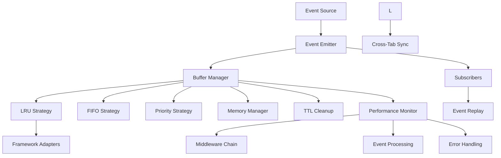

# The Base Event - Architecture Overview

## 🎯 **Core System**

Framework-agnostic event bus with intelligent buffering that prevents lost events through replay functionality while maintaining memory safety and high performance.

---

## 🏗️ **System Components**

### **Core Engine** (`src/core/`)
- **Event Types**: Type-safe event structures and validation schemas
- **Buffer Management**: Intelligent buffering with multiple eviction strategies
- **Event Emitter**: Framework-agnostic core with middleware support
- **Performance Monitoring**: Built-in metrics collection and analysis
- **Memory Management**: TTL-based cleanup and size limits

### **Buffer Strategies**
- **LRU**: Least Recently Used - Optimal for frequently accessed data
- **FIFO**: First In, First Out - Chronological ordering
- **Priority**: High/Medium/Low - Critical event prioritization

### **Memory Management**
- **TTL Cleanup**: Time-based event expiration
- **Size Limits**: Configurable maximum buffer size
- **Cross-Tab Sync**: Buffer sharing across browser windows

---

## 🎨 **Architecture Diagram**

---

## 🎯 **Key Features**

### **Event Replay**
- Events buffered before subscription are replayed
- Intelligent delivery based on channel history
- Memory-efficient replay mechanisms

### **Performance Optimization**
- 100K+ events per second target
- Sub-1ms processing latency
- Tree-shakable imports for minimal bundles
- Strategy-based buffer management

### **TypeScript First**
- 100% type coverage
- Generic event handling with strong typing
- Compile-time error prevention
- Schema validation for event payloads

### **Memory Safety**
- Automatic cleanup of expired events
- Configurable size limits
- Memory usage monitoring
- Cross-environment synchronization

---

## 📊 **Performance Characteristics**

| Component | Target | Notes |
|------------|---------|---------|
| Event Throughput | ≥100K/sec | High-frequency optimization |
| Latency | <1ms | Minimal overhead |
| Memory Usage | Controlled | TTL + limits |
| Bundle Size | ≤1.5KB | Tree-shaking ready |

---

## 🔄 **Integration Points**

### **Framework Adapters**
- React Hook (`useNotificationChannel`)
- Angular Service (`NotificationService`)
- Vue Composable (`useNotificationChannel`)
- Node.js Module (direct usage)

### **Extensions**
- Security Module (optional)
- Migration Utilities
- Plugin System (middleware-based)

---

*Architecture overview: Core system design with intelligent buffering*